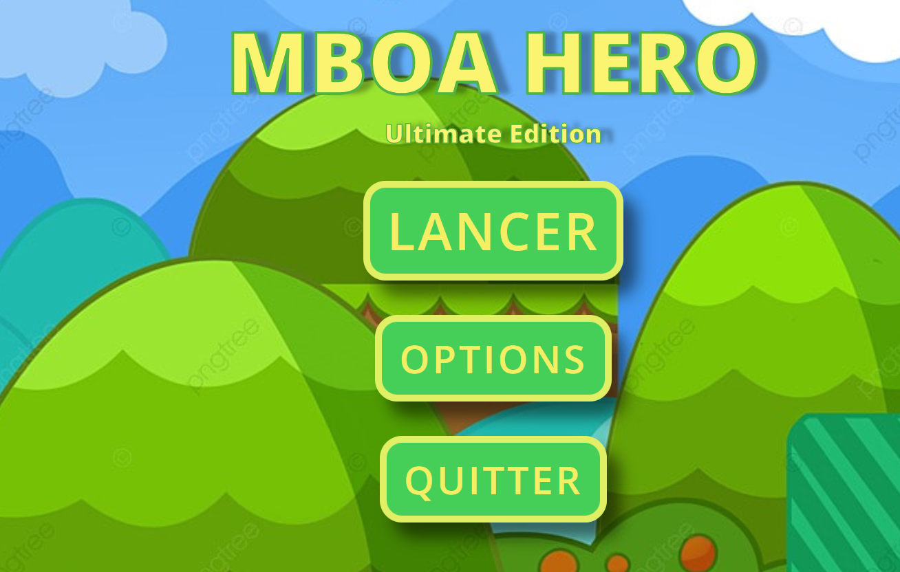

# Mboa Heroes – Interface de Jeu Plateforme

## 📌 Description
Ce projet implémente une **interface de jeu** pour un jeu de plateforme appelé *Mboa Heroes*, en HTML, CSS et JavaScript.

## 🚀 Fonctionnalités
- Interface graphique avec menus et HUD
- Éléments de jeu : score, vies, feedback visuel
- Style rétro inspiré des jeux 2D classiques

## 🛠 Technologies
- HTML
- CSS
- JavaScript

## 📸 Aperçu
